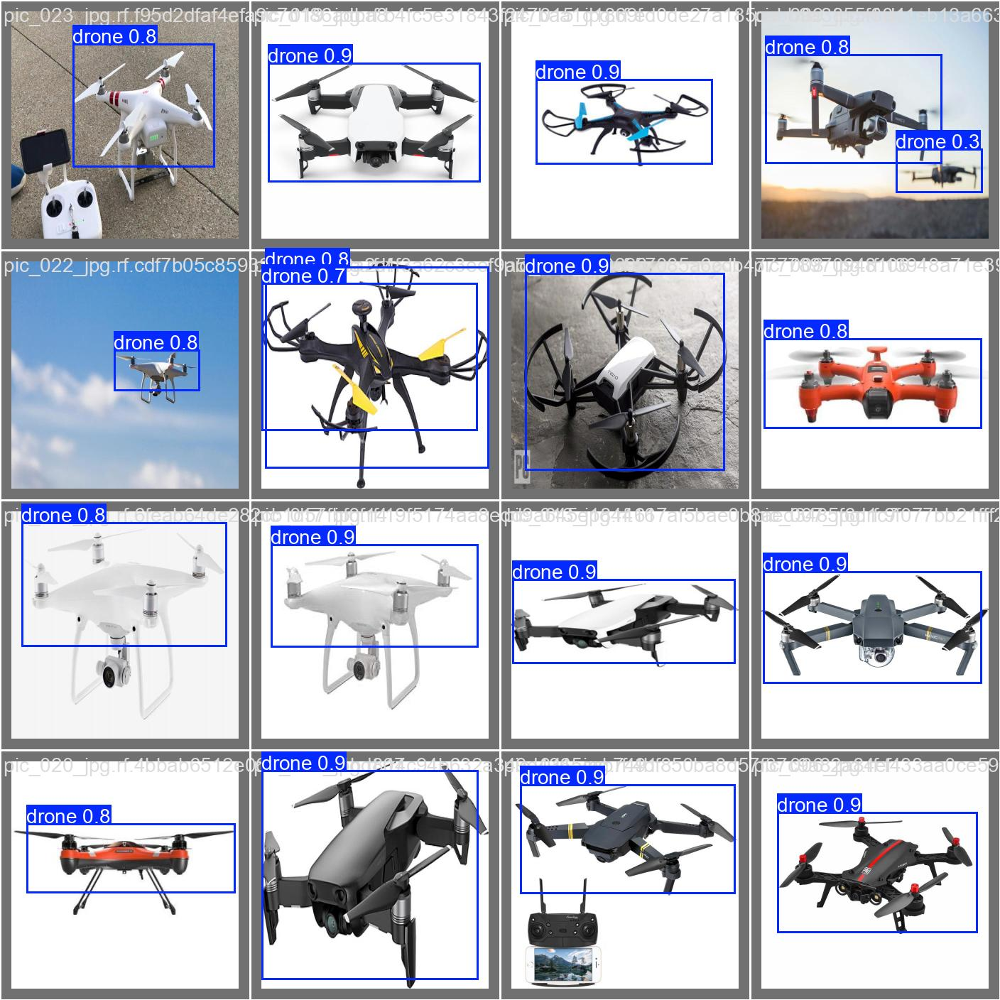
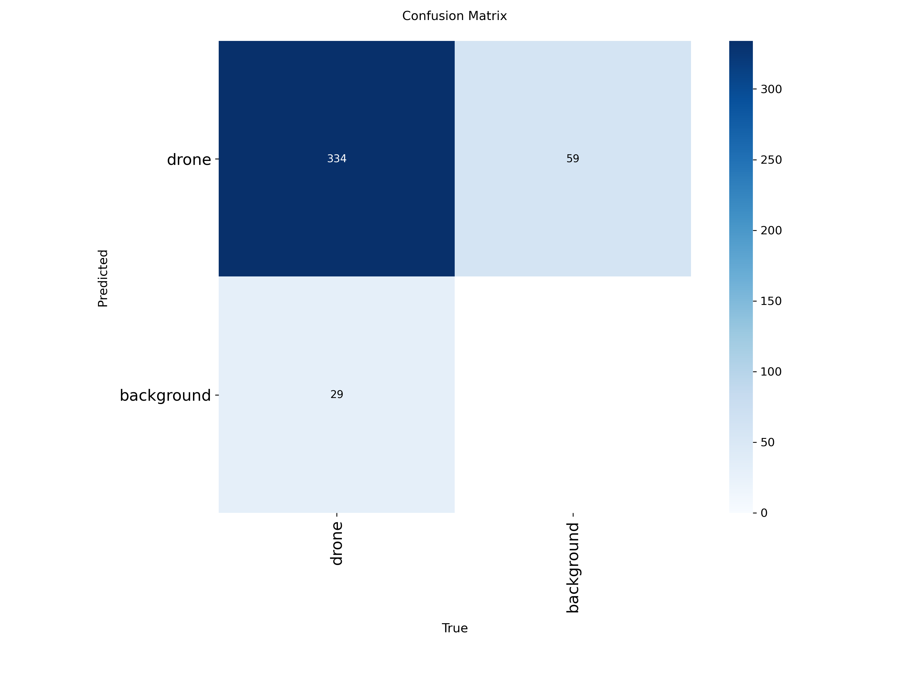
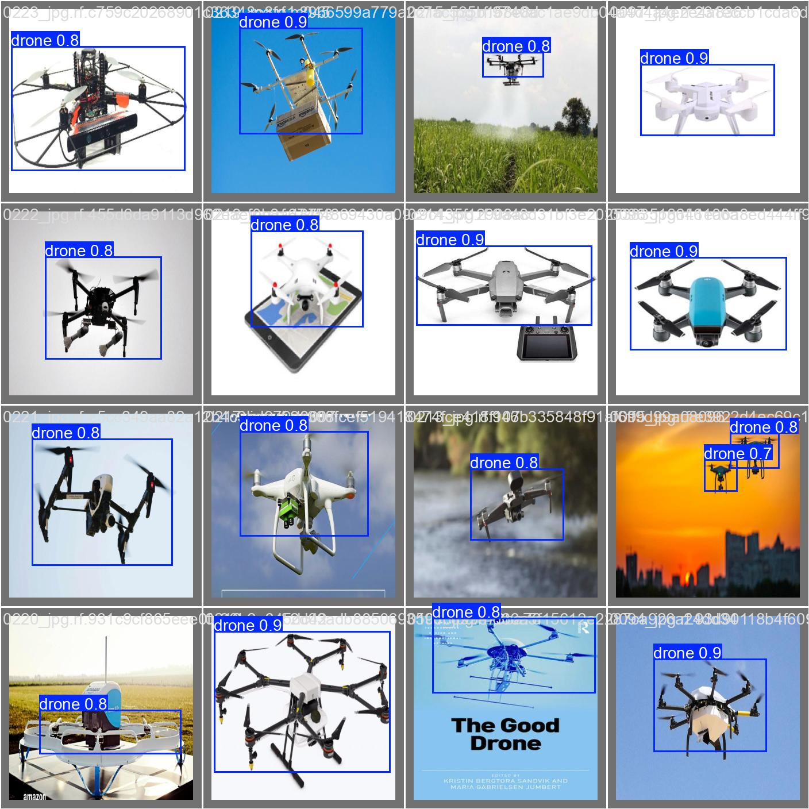
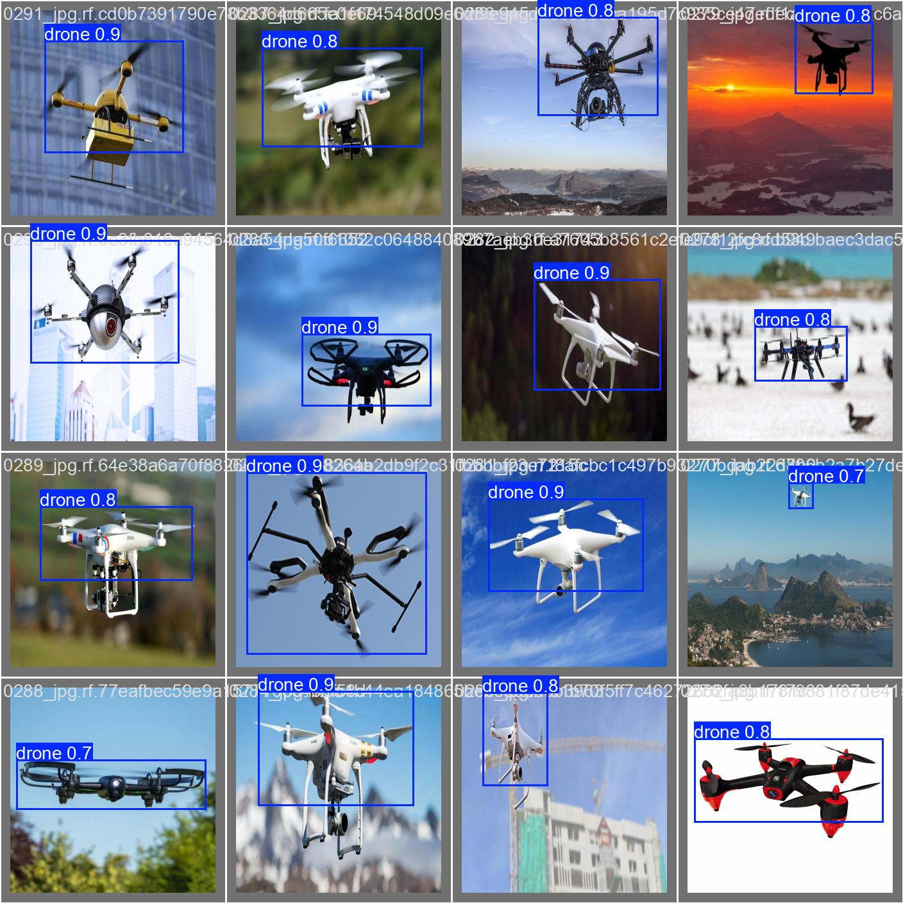

# YOLOv5 Fine-Tuning: Drone Detection


Ce projet présente un fine-tuning de YOLOv5 pour détecter des drones sur des images aériennes.  
Le modèle a été entraîné sur Colab et tous les résultats (matrices de confusion, exemples d’évaluation) sont inclus dans le dossier `models/drone_yolov5s2/`.

---

---

## Aperçu du modèle
 

---

## Installation
Installer les dépendances :

```bash
pip install -r requirements.txt
```
---

## Contenu du dépôt
```

├─ models/drone_yolov5s/
│  ├─ weights/
│  │  ├─ best.pt # Meilleur modèle entraîné
│  │  └─ last.pt # Dernier checkpoint
│  ├─ results/ # Images de validation avec prédictions
│  └─ confusion_matrix.png
├─ train_colab.ipynb # Notebook d'entrainement du modèle
├─ evaluate.py   # Script pour évaluer le modèle
├─ README.md
├─ requirements.txt
```

---

## Utilisation du modèle

Le modèle fine-tuné est déjà disponible dans `models/drone_yolov5s2/weights/best.pt`.  

### Tester sur une image ou un dossier
Vous pouvez utiliser l’API Ultralytics YOLO :

```python
from ultralytics import YOLO
import torch

# Chemin vers le meilleur modèle
MODEL_PATH = "models/drone_yolov5s/weights/best.pt"

# Sélection du device
device = torch.device("cuda" if torch.cuda.is_available() else "cpu")

# Charger le modèle
model = YOLO(MODEL_PATH)

# Tester sur une image
results = model.predict(source="data/images/test_image.jpg", conf=0.5, device=device)

# Afficher les résultats
for pred in results:
    pred.show()  # Affiche l'image avec les bounding boxes
```

- source peut être une image unique ou un dossier d’images.
- Les résultats apparaîtront directement avec les boîtes dessinées.


### Évaluation via le script evaluate.py
```bash
python evaluate.py --image_path "path/to/image_or_folder"
```

## Résultats d’évaluation


### Matrice de confusion : 
 

### Galerie d’exemples de prédictions
 